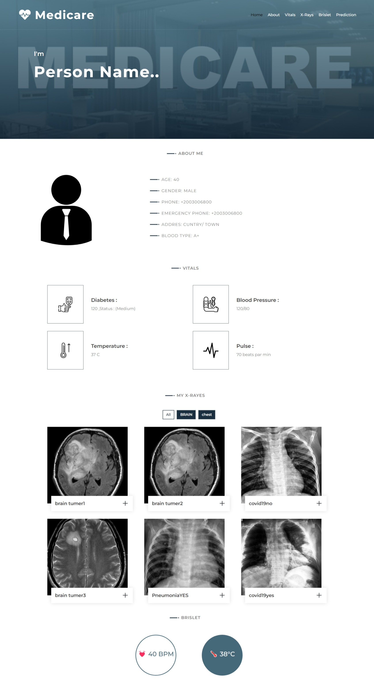
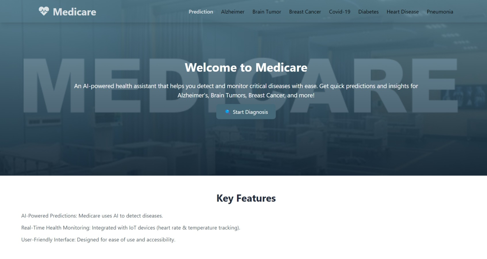
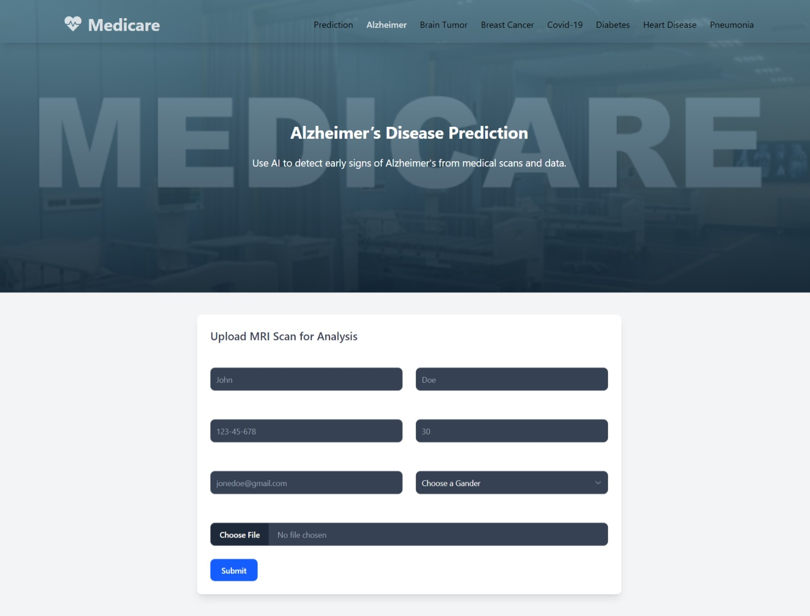

# Medicare - AI-Powered Disease Prediction System

## 📌 Overview
Medicare is a Flask-based AI-driven medical diagnosis system that assists in predicting various diseases using machine learning models. The system enables users to input relevant medical parameters and receive predictions for multiple conditions, enhancing early diagnosis and patient care.

## 🚀 Features
- AI-powered disease prediction
- Support for multiple diseases:
  - Alzheimer's Disease
  - Brain Tumor Detection
  - COVID-19 Diagnosis
  - Pneumonia Detection
  - Breast Cancer Prediction
  - Diabetes Prediction
  - Heart Disease Prediction
- Interactive web interface using Flask
- User-friendly input forms for medical parameters

## 🏗️ Tech Stack
- **Backend:** Flask, Python
- **Frontend:** HTML, CSS
- **Machine Learning:** Scikit-learn, TensorFlow, OpenCV
- **Deployment:** (Not yet deployed)

## 📂 Project Structure
```
medicare/
│── models/             # Pre-trained AI models
│── static/             # CSS, JavaScript, and images
│── templates/          # HTML templates
│── app.py              # Main Flask application
│── requirements.txt    # Dependencies
│── .gitignore          # Ignored files

```

## 📸 Implementation Screenshots
(Add images here after uploading)






## 🔧 Installation & Setup
1. Clone the repository:
   ```bash
   git clone https://github.com/Abuhamida/medicare_predection.git
   cd medicare_predection
   ```
2. Create a virtual environment (optional but recommended):
   ```bash
   python -m venv venv
   source venv/bin/activate  # On Windows use 'venv\Scripts\activate'
   ```
3. Install dependencies:
   ```bash
   pip install -r requirements.txt
   ```
4. Run the Flask application:
   ```bash
   python app.py
   ```
5. Open in browser:
   - Navigate to `http://127.0.0.1:5000/`

## 📜 License
This project is licensed under the MIT License.

## 🤝 Contribution
Feel free to contribute! Fork the repository, create a new branch, and submit a pull request.

## 📞 Contact
- **Author:** Mohamed Ramdan AbuHamida
- **GitHub:** [Abuhamida](https://github.com/Abuhamida)
- **LinkedIn:** [Mohamed AbuHamida](https://www.linkedin.com/in/mohammed-abuhamida-969693220/)

